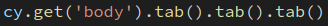
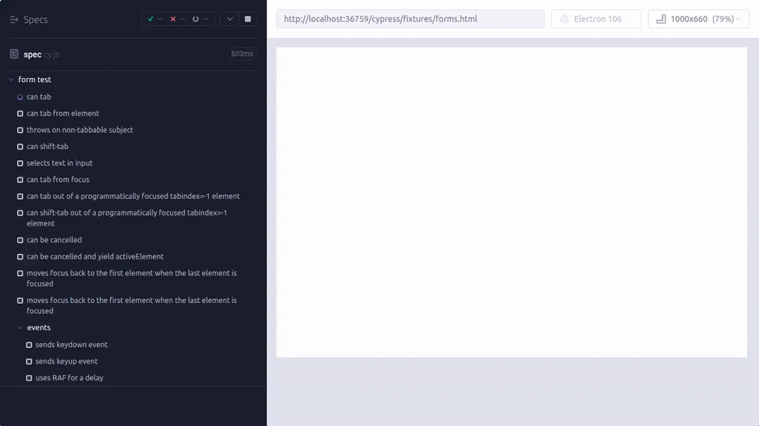

<div align="center">
    <h1>cypress-plugin-tab</h1>
    <a href="https://www.npmjs.com/package/cypress-plugin-tab"></a>
    <a href="https://www.npmjs.com/package/cypress-plugin-tab"></a>
    <a href="https://github.com/kuceb/cypress-plugin-tab/blob/master/LICENSE"></a>
<p>A Cypress plugin to add a tab command</p>

</div>




### Installation

This package supports Cypress 10+.

1. Install the plugin:

```bash
npm install -D cypress-plugin-tab
```

2. Load it from your Cypress support file at **`cypress/support/e2e.js`**:

```js
require('cypress-plugin-tab')
```

If your support file is TypeScript, use:

```ts
import 'cypress-plugin-tab'
```

3. Make sure your Cypress config points at that support file. Example **`cypress.config.js`**:

```js
const { defineConfig } = require('cypress')

module.exports = defineConfig({
  e2e: {
    supportFile: 'cypress/support/e2e.js',
  },
})
```

4. If you use TypeScript and want the custom command typed in editors, add the package to your Cypress tsconfig:

```json
{
  "compilerOptions": {
    "types": ["cypress", "cypress-plugin-tab"]
  }
}
```

### Usage

- `.tab()` must be chained off of a tabbable(focusable) subject, or the `body`
- `.tab()` changes the subject to the newly focused element after pressing `tab`
- `.tab({ shift: true })` sends a shift-tab to the element

```js
cy.get('input').type('hello').tab().type('world') // type foo, then press tab, then type bar
cy.get('body').tab() // tab into the first tabbable element on the page
cy.focused().tab() // tab into the currently focused element
```

shift+tab:

```js
cy.get('input')
  .type('hwllo')
  .tab()
  .type('world')
  .tab({ shift: true })
  .type('hello') // correct your mistake
```

### License

[MIT](LICENSE)
